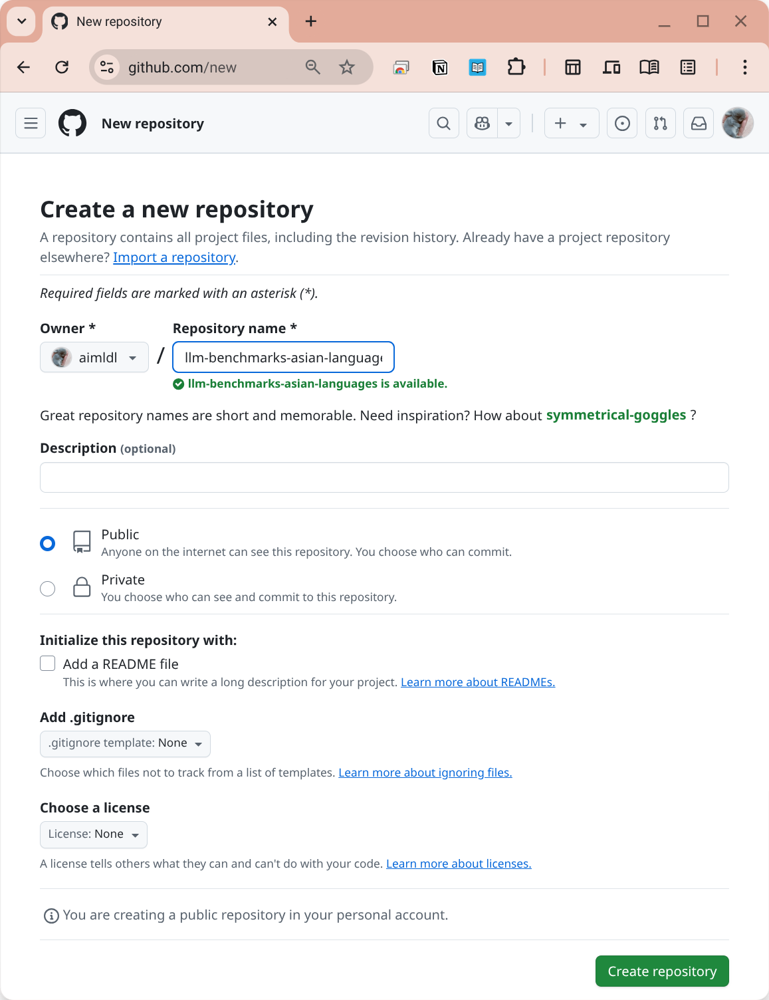
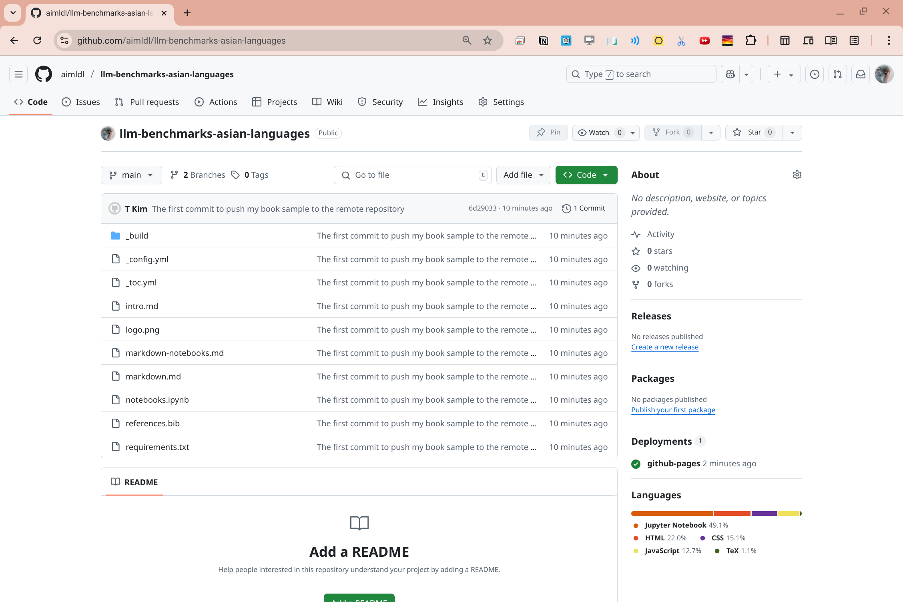
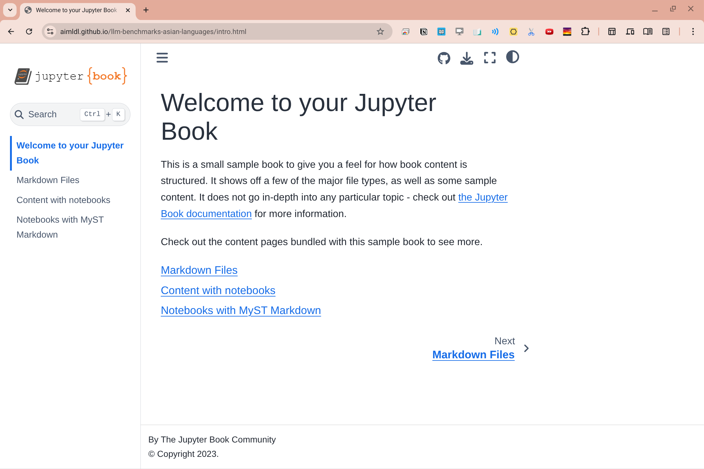

# Configuration and Basic Usage
- Created: 2023-07-31 (Mon)
- Updated: 2025-07-05 (Sat)

The process of creating and publishing a book with Jupyter Book follows three main steps: creating the content, building the book, and then publishing it online.

For simplicity, an alias `jb` is used below instead of the full command `jupyter-book`.

## 1. Create Content
You can begin by generating a template for a new book using the `create` command.

```Bash
jb create my-book-sample/
```
This command populates a directory with key files for your book:
- _config.yml: The primary configuration file where you can set your book's title, author, and other settings.
- _toc.yml: The table of contents file which dictates the structure of your book.
- Content Files: The actual pages of your book, which can be in Markdown (.md) or Jupyter Notebook (.ipynb) formats.

For example,
```bash
(jupyter-book) aimldl@tkim-glinux:~$ jb create my-book-sample/

===============================================================================

Your book template can be found at

    my-book-sample/

===============================================================================

(jupyter-book) aimldl@tkim-glinux:~$ ls
  ... my-book-sample ...
(jupyter-book) aimldl@tkim-glinux:~$ tree my-book-sample/
my-book-sample/
├── _config.yml
├── _toc.yml
├── intro.md
├── logo.png
├── markdown-notebooks.md
├── markdown.md
├── notebooks.ipynb
├── references.bib
└── requirements.txt

1 directory, 9 files
(jupyter-book) aimldl@tkim-glinux:~$ 
```

## 2. Build Your Book
To compile your source files into an HTML website, use the `build` command:

```Bash
jb build my-book-sample/
```
This command generates a `_build/html` directory that contains the complete website. You can preview your book by opening the `index.html` file within that folder in a web browser.

For example,
```bash
(jupyter-book) aimldl@tkim-glinux:~$ jb build my-book-sample/
Running Jupyter-Book v1.0.4.post1
Source Folder: /usr/local/google/home/thekim/my-book-sample
Config Path: /usr/local/google/home/thekim/my-book-sample/_config.yml
Output Path: /usr/local/google/home/thekim/my-book-sample/_build/html
Running Sphinx v7.4.7
loading translations [en]... done
making output directory... done
[etoc] Changing master_doc to 'intro'
checking bibtex cache... out of date
parsing bibtex file /usr/local/google/home/thekim/my-book-sample/references.bib... parsed 5 entries
  ...
[etoc] missing index.html written as redirect to 'intro.html'
build succeeded.

The HTML pages are in my-book-sample/_build/html.

===============================================================================

Finished generating HTML for book.
Your book's HTML pages are here:
    my-book-sample/_build/html/
You can look at your book by opening this file in a browser:
    my-book-sample/_build/html/index.html
Or paste this line directly into your browser bar:
    file:///usr/local/google/home/thekim/my-book-sample/_build/html/index.html            

===============================================================================

(jupyter-book) aimldl@tkim-glinux:~$ 
```

If you make changes such as removing files or altering the table of contents, it is a good practice to clean the build artifacts before rebuilding. You can remove just the HTML output with:

```Bash
jb clean --html my-book-sample
```
Or to remove the entire `_build` directory, use:

```Bash
jb clean --all my-book-sample
```

## 3. Publish Your Book Online
To publish your book using GitHub Pages, you'll first need to push your book's source files to a GitHub repository.

### 3-1. Create a new repository on GitHub and push the book's source files.
- Create a new repository on GitHub, ensuring you do not initialize it with a README file.
- Clone this repository to your local machine.
- Copy the source files of your book into the directory you just cloned.
- Commit and push these files to your remote repository on GitHub.

For example,
- Create a new repository on GitHub, ensuring you do not initialize it with a README file.


Click the `Create repository` button.

- Clone this repository to your local machine.
    - Go to your local machine
    - (Optional) Create a sub-directory `github/aimldl`.
    - (Optional) `cd` into this directory.

 ```bash
(jupyter-book) aimldl@tkim-glinux:~/github/aimldl$
(jupyter-book) aimldl@tkim-glinux:~/github/aimldl$ git clone https://github.com/aimldl/llm-benchmarks-asian-languages.git
Cloning into 'llm-benchmarks-asian-languages'...
warning: You appear to have cloned an empty repository.
(jupyter-book) aimldl@tkim-glinux:~/github/aimldl$ ls
  ...  llm-benchmarks-asian-languages  ...
(jupyter-book) aimldl@tkim-glinux:~/github/aimldl$ 
```

Currently, the repository is empty.
```bash
(jupyter-book) aimldl@tkim-glinux:~/github/aimldl$ tree llm-benchmarks-asian-languages/
llm-benchmarks-asian-languages/

0 directories, 0 files
(jupyter-book) aimldl@tkim-glinux:~/github/aimldl$ 
```

- Copy the source files of your book into the directory you just cloned.
To verify, run the `tree` command again.
```bash
(jupyter-book) aimldl@tkim-glinux:~/github/aimldl$ tree llm-benchmarks-asian-languages/
llm-benchmarks-asian-languages/
├── _build
│   ├── html
│   │   ├── _images
│   │   │   └── e8d5d74c8d69bbb9dbe6c406bf505595d9e05ff6163624496c49d8d6fff87a07.png
│   │   ├── _sources
│   │   │   ├── intro.md
│   │   │   ├── markdown-notebooks.md
│   │   │   ├── markdown.md
│   │   │   └── notebooks.ipynb
  ...
├── _config.yml
├── _toc.yml
├── intro.md
├── logo.png
├── markdown-notebooks.md
├── markdown.md
├── notebooks.ipynb
├── references.bib
└── requirements.txt

108 directories, 175 files
(jupyter-book) aimldl@tkim-glinux:~/github/aimldl$
```
- Commit and push these files to your remote repository on GitHub.

```bash
cd llm-benchmarks-asian-languages/
git add .
git commit -m "The first commit to push my book sample to the remote repository"
git push -u origin main
```
For example,

```bash
(jupyter-book) aimldl@tkim-glinux:~/github/aimldl$ cd llm-benchmarks-asian-languages/
(jupyter-book) aimldl@tkim-glinux:~/github/aimldl/llm-benchmarks-asian-languages$ git add .
(jupyter-book) aimldl@tkim-glinux:~/github/aimldl/llm-benchmarks-asian-languages$ git commit -m "The first commit to push my book sample to the remote repository"
  ...
 181 files changed, 13271 insertions(+)
 create mode 100644 _build/.doctrees/environment.pickle
 create mode 100644 _build/.doctrees/intro.doctree
  ...
 create mode 100644 _config.yml
 create mode 100644 _toc.yml
 create mode 100644 intro.md
 create mode 100644 logo.png
 create mode 100644 markdown-notebooks.md
 create mode 100644 markdown.md
 create mode 100644 notebooks.ipynb
 create mode 100644 references.bib
 create mode 100644 requirements.txt
(jupyter-book) aimldl@tkim-glinux:~/github/aimldl/llm-benchmarks-asian-languages$ git push -u origin main
Username for 'https://github.com': aimldl
Password for 'https://aimldl@github.com':
  ...
Total 283 (delta 74), reused 0 (delta 0), pack-reused 0 (from 0)
remote: Resolving deltas: 100% (74/74), done.
To https://github.com/aimldl/llm-benchmarks-asian-languages.git
 * [new branch]      main -> main
branch 'main' set up to track 'origin/main'.
(jupyter-book) aimldl@tkim-glinux:~/github/aimldl/llm-benchmarks-asian-languages$
```
The `main` branch should look similar to:



### 3-2. Publish the HTML version of your book using the `ghp-import` package 
After your source files are on GitHub, you can publish the HTML version of your book using the `ghp-import` package. 

First, you may need to install it:

```Bash
pip install ghp-import
```

From within your local repository's directory, run the following command to push the contents of the `_build/html` folder to the `gh-pages` branch:

```Bash
ghp-import -n -p -f _build/html
```

For example,

```bash
(jupyter-book) aimldl@tkim-glinux:~/github/aimldl/llm-benchmarks-asian-languages$
(jupyter-book) aimldl@tkim-glinux:~/github/aimldl/llm-benchmarks-asian-languages$ ghp-import -n -p -f _build/html
Username for 'https://github.com': aimldl
Password for 'https://aimldl@github.com':
  ...
Total 270 (delta 105), reused 269 (delta 105), pack-reused 0 (from 0)
remote: Resolving deltas: 100% (105/105), done.
remote: 
remote: Create a pull request for 'gh-pages' on GitHub by visiting:
remote:      https://github.com/aimldl/llm-benchmarks-asian-languages/pull/new/gh-pages
remote: 
To https://github.com/aimldl/llm-benchmarks-asian-languages.git
 * [new branch]      gh-pages -> gh-pages
(jupyter-book) aimldl@tkim-glinux:~/github/aimldl/llm-benchmarks-asian-languages$ 

```
### 3-3. Check the published result
Your book should then be live and accessible at a URL similar to `https://<your-username>.github.io/<your-repository-name>/`.

For example, navigate to https://aimldl.github.io/llm-benchmarks-asian-languages.


